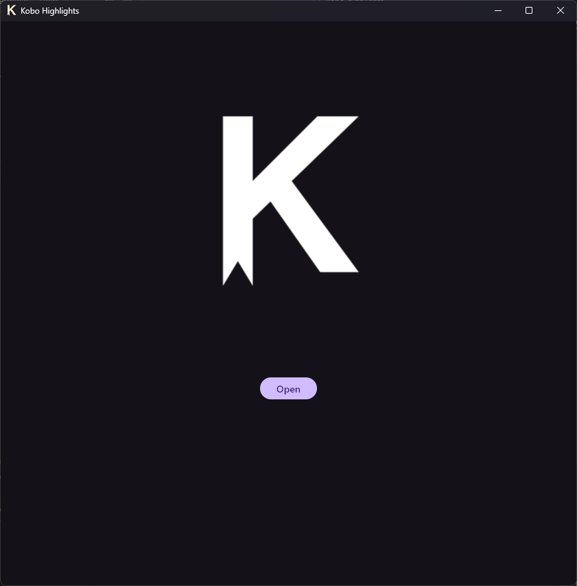
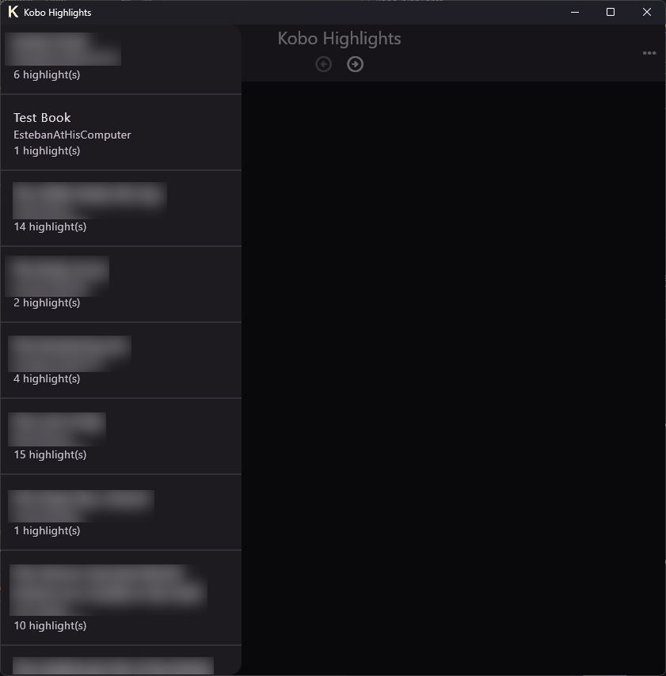
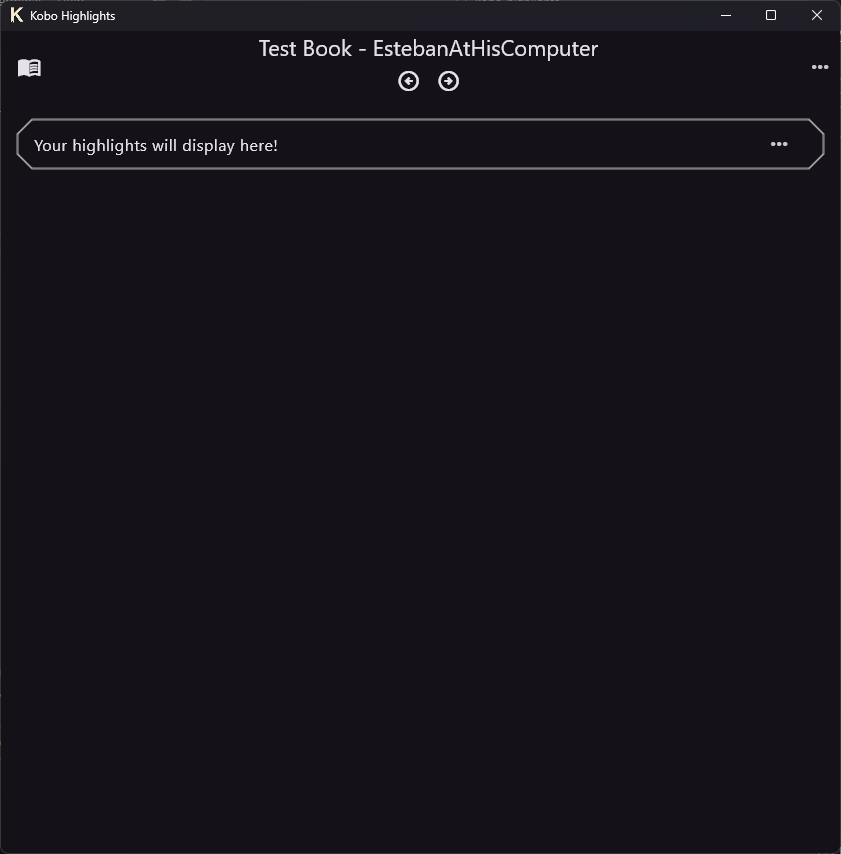
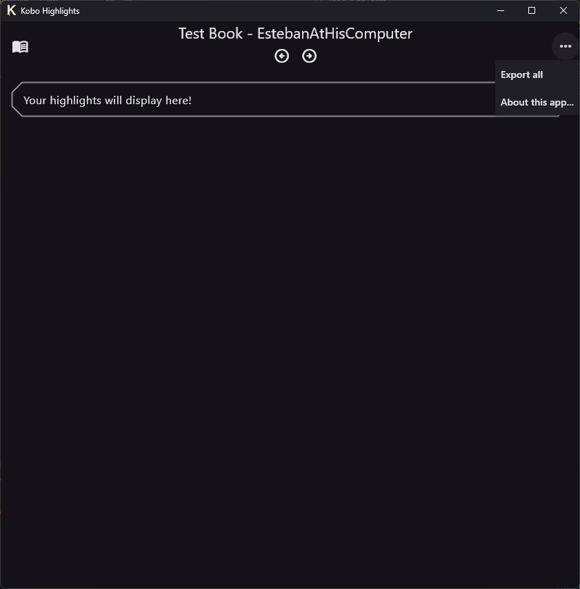
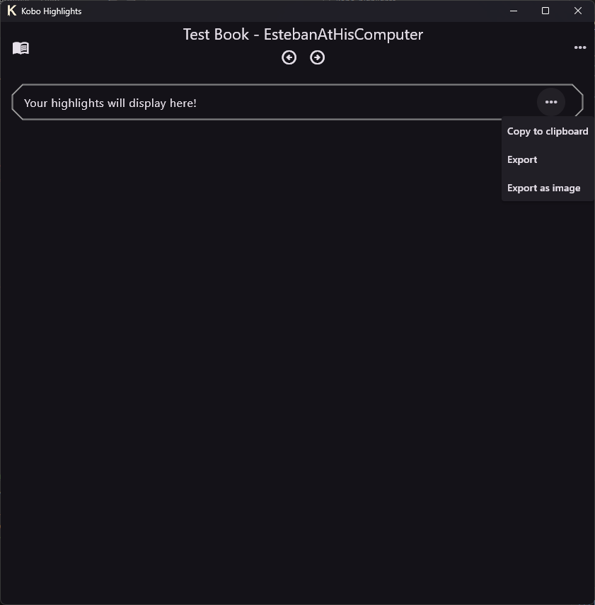
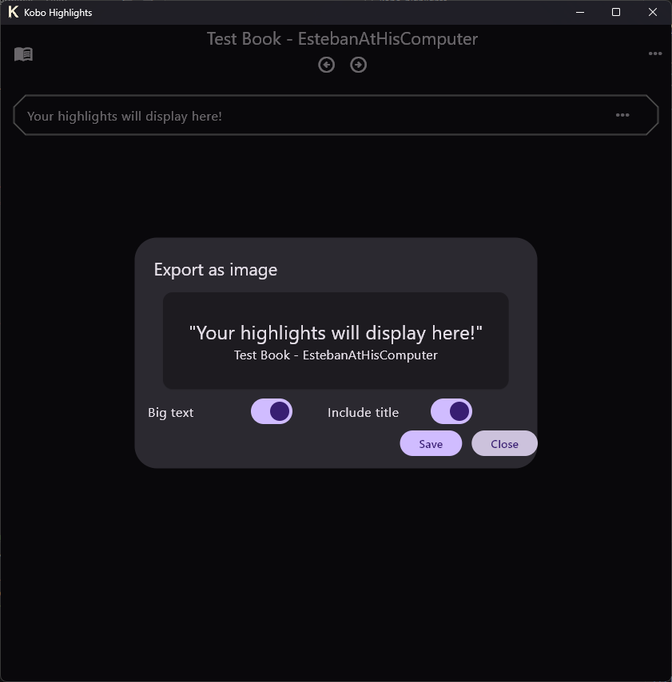

# Kobo Highlights
A Flutter aplication to view, organize and export highlights created on a Kobo eReader. Parsing a `KoboReader.sqlite` database, it displays any saved highlights on a user-friendly interface which allows users to read their saved fragments and export them either individually or in batches. It also supports exporting highlights as images, for ease of sharing on social media.

Note that this application has only been tested with a database obtained from a Kobo Aura H2O Edition 2. While it should be compatible with other models that use the same database structure, perfect compatibility cannot be guaranteed. In case of errors, pull requests offering solutions are very welcome (see [Contributing](#contributing)).

## Installation
### Windows
No installation is required. Unzip the compressed folder in your prefered location and run the .exe file.
### Linux
No installation is required. You can directly execute the `.appimage` file to launch the application.
### MacOS / Mobile / Web / Others
The project has not been tested to work on any platforms other than Windows and Linux and correct functionality can't be confirmed at this time in any other platform. Issues and pull requests oriented to document and fix functionality on those platforms would be greatly appreciated.

## Building from source
* Make sure you have Flutter installed and properly configured on your system. You can find instructions to do so on [Flutter's official docs](https://docs.flutter.dev/get-started).

* Clone the repo
   ```sh
   git clone https://github.com/EstebanAtHisComputer/KoboHighlightsFlutter
   ```
* Install and update dependencies
    ```sh
    flutter pub get
    ```
### Windows
We use the default Flutter build system for windows. 
```sh
flutter build windows
```
### Linux
The default Flutter build system is an option if you only want an executable file.
```sh
flutter build linux
```
We also support packaging the application into an AppImage,using [FastForge](https://fastforge.dev/). If you wish to do so:
* Install FastForge: `dart pub global activate fastforge`.
* Install the required dependencies, [as mentioned on FastForge docs](https://fastforge.dev/makers/appimage):
    ```sh
    sudo apt install locate
    wget -O appimagetool "https://github.com/AppImage/appimagetool/releases/download/continuous/appimagetool-x86_64.AppImage"
    chmod +x appimagetool
    mv appimagetool /usr/local/bin/
    ```
    The comands may vary depending on your Linux distribution.
* From the project's root folder, run `fastforge release --name linux-appimage`
* Your `.appimage` file will be built on the `dist` folder.

## Usage
### The main screen

Upon loading the application, click the "Open" button to select your `KoboReader.sqlite` file. It should be situated on the `.kobo` hidden folder of your eReader, but the location may vary depending on the specific model of your eReader and the configuration of your operating system. If you can't locate this file, please search online for the specific path appropiate to your use case.

If the database has been loaded correctly, the main interface will show up and the sidebar will automatically open. This sidebar will display every book that has at least one highlight stored on your device. You can scroll up and down the list with the mouse wheel or by using the scroll bar. If you close the sidebar by mistake (by clicking outside of it), you can reopen it by clicking on the `Open book list` () icon.

Click on a book to load its highlights; they will be displayed on the main body of the app. Like the book list, you can scroll through them with the mouse wheel or the scroll bar.

### The top bar
Once a book is loaded, the top bar will display a series of icons.

As mentioned above, the `Open book list` () icon will reopen the sidebar, allowing you to select a different book.

The `Previous book` () and `Next book` () icons, under the book title, allow you to quickly navigate to other books without opening the book list.
Finally, the `More...` () icon, on the right corner, gives you a series of options.


The `Export all` option will ask you for a path, and will create there a .txt file containing all the highlights from the selected book.
The `About this app...` option will display the license information of this app and every dependency it uses.

### The highlight menu
Every highlight includes a `View options` ()  icon that allows you to export the text out the application in a variety of ways.


The simpler one, `Copy to clipboard`, does exactly that: it will copy the highlight's text and the book title and author to your system clipboard, so you can paste anywhere else.

`Export` works in a similar way as the `Export all` option mentioned on [The top bar](#the-top-bar), but for a single highlight.



The last option, `Export as image`, allows you to generate an image containing the text so you can upload it to social media or other visually-centered places. You can choose the text size and if you wish to include the book title and author or not. Once you're happy with the result, click the `Save` button to generate a `.png` file with your highlight.

## Contributing
This project welcomes pull requests. Contribution guidelines and instructions can be found on [`CONTRIBUTING.md`](https://github.com/EstebanAtHisComputer/KoboHighlightsFlutter/blob/main/CONTRIBUTING.md).

Note that the project does not accept pull requests seeking to add AI-powered features to the application and pull requests with AI-generated code are heavily discouraged.

## License Disclaimer
This project is licensed under a MIT license. You can read more about it on the [`LICENSE.md`](https://github.com/EstebanAtHisComputer/KoboHighlightsFlutter/blob/main/LICENSE.md) file.

KOBO is a registered trademark owned by RAKUTEN KOBO INC., a TORONTO, ONTARIO based entity.
This software is not affiliated, associated, authorized, or endorsed in any way by RAKUTEN KOBO INC.

Licenses from the project's dependency libraries can be seen on the `About this app...` option of the software.

## AI Disclaimer
No part of this software has been coded, designed, developed, planned, or involved otherwise in any way with Large Language Models ("AI"). No features using AI in any way will be implemented at any point.
